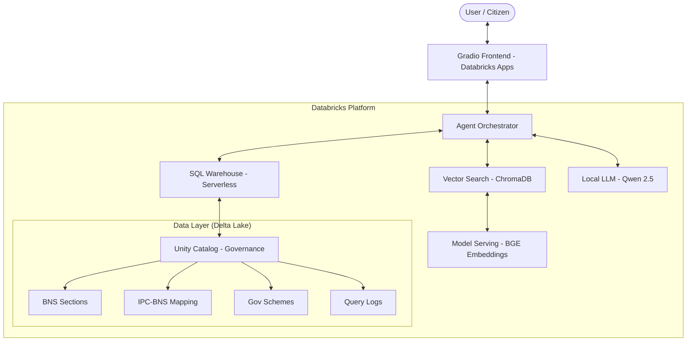

# ⚖️ Nyaya-Sahayak | न्याय सहायक
### AI-Powered Indian Legal Assistant | Making Law Accessible to Every Citizen

**What it does:** Nyaya-Sahayak is an AI legal assistant that simplifies the new Indian laws (BNS, BNSS, BSA) and government schemes for citizens, providing accurate answers and eligibility checks in both Hindi and English.

---

## 🏛️ Architecture Diagram



---

## 🚀 How to Run (Exact Commands)

1.  **Clone the repository:**
    ```bash
    git clone https://github.com/saranshtaneja/bharatbricks.git
    cd bharatbricks/nyaya-sahayak-app
    ```

2.  **Install Databricks CLI** (if not installed):
    ```bash
    curl -fsSL https://raw.githubusercontent.com/databricks/setup-cli/main/install.sh | sh
    ```

3.  **Authenticate:**
    ```bash
    databricks configure
    ```

4.  **Deploy the Application:**
    ```bash
    databricks apps deploy nyaya-sahayak --source-code-path .
    ```

---

## 📺 Demo Steps

1.  **Open the App**: Click the URL generated after deployment (e.g., [https://nyaya-sahayak-7474658202219613.aws.databricksapps.com](https://nyaya-sahayak-7474658202219613.aws.databricksapps.com)).
2.  **Ask a Legal Question**:
    - Select the **⚖️ Legal Assistant** tab.
    - **Prompt**: Type `What is BNS Section 103?` or `धारा 103 क्या है?`
    - **Click**: The "Ask" button.
3.  **Check Scheme Eligibility**:
    - Select the **🏛️ Scheme Eligibility** tab.
    - **Action**: Set State to `Madhya Pradesh`, Occupation to `Farmer`, and Income to `150000`.
    - **Click**: "Check My Eligibility".
4.  **Compare Laws (IPC to BNS)**:
    - Select the **📝 IPC → BNS Changes** tab.
    - **Prompt**: Type `302` (for murder) or `420` (for cheating).
    - **Click**: "Find Changes".

---

## 🔐 Repository Status
This repository is **Public** and will remain public for at least **30 days** as per submission requirements.

---
Built for **Bharat Bricks Hacks 2026** | Team **IIT Indore** | Powered by **Databricks**


## Dataset
The files in the folder 'dataset' along with https://www.indiacode.nic.in/bitstream/123456789/20062/2/Hh202345.pdf are the dataset used for the project.